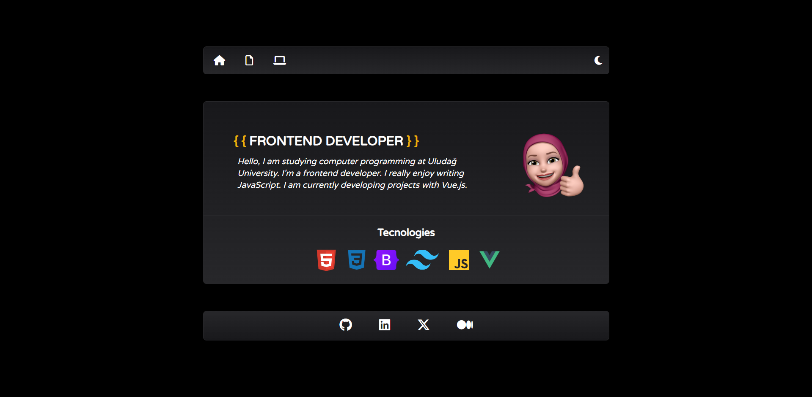
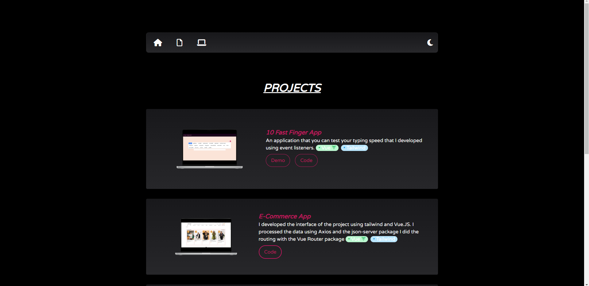
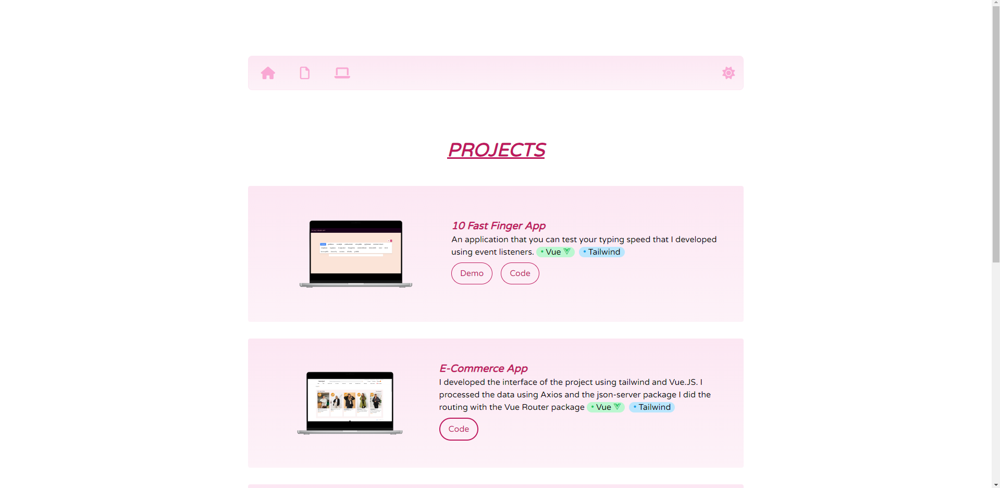

# [iremates.dev](https://iremates-dev.vercel.app/)

## Project Setup

```sh
git clone https://github.com/irematess/iremates.dev.git
```

```sh
cd iremates.dev
```

```sh
yarn / npm install 
```

```sh
yarn dev / npm run dev
```

## Screenshots






